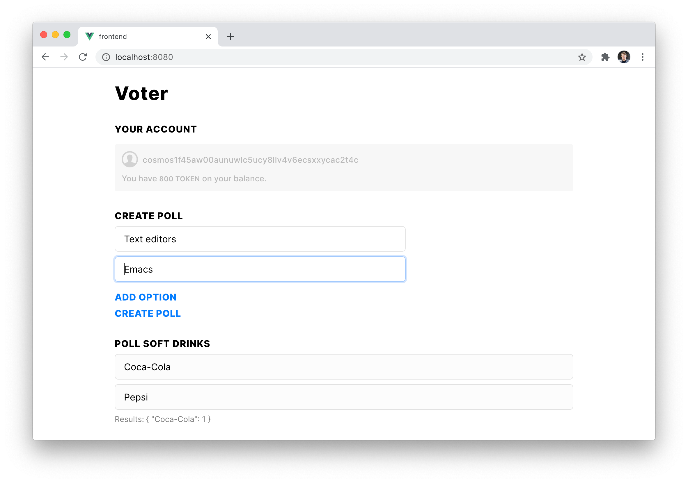
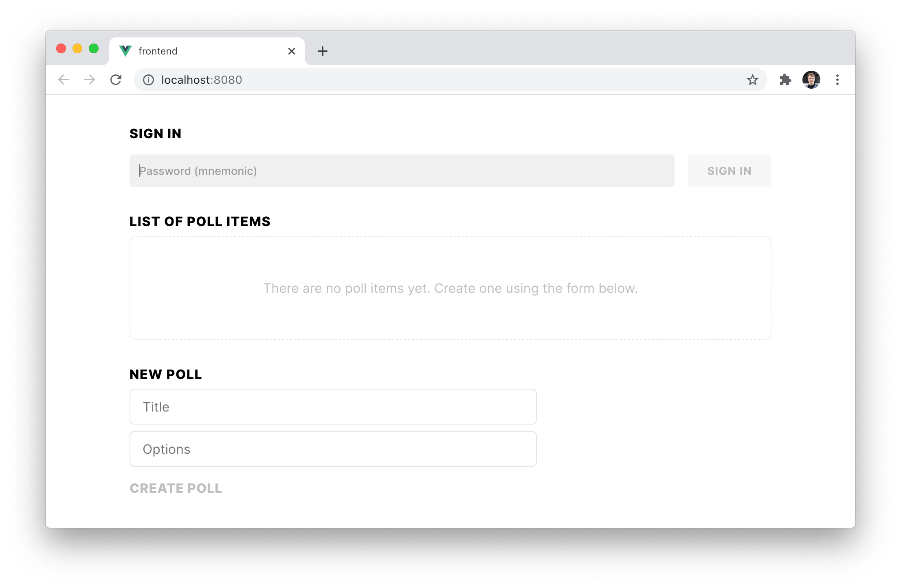

# Polling app



We will be creating a simple poll application, in which a user can sign in, create polls, cast votes and see voting results. Creating a poll will cost 200 tokens, voting is free, and both actions will be available only for signed in users.

For this tutorial we will be using [Starport](https://github.com/tendermint/starport), an easy to use tool for building blockchains. [Install Starport](https://github.com/tendermint/starport#installation) and run the following command to create a voter project:

```
starport app github.com/alice/voter
```

Starport `app` command will scaffold a project structure for your application in a `voter` directory. Make sure to replace `alice` with your GitHub username.

Inside the `voter` directory we can see several files and directories:

- `app` contains files that connect all of the moving parts of your application.
- `cmd` is responsible for `voterd` and `votercli` programs, which respectively allow you to start your application and interact with it.
- `vue` contains a web user interface for your app, reponsible for everything you see on the screenshot above.
- `x` contains the main building blocks of you app: modules. Right now we have only one: `voter`.

Our project's directory contains all the code required to build and launch a blockchain-based app. Let's try launching our app by running starport serve inside our project:

```
starport serve
```

```
📦 Installing dependencies...
🚧 Building the application...
💫 Initializing the chain...
🙂 Created an account. Password (mnemonic): truth tooth front fabric sing divert zone milk fatigue urban hundred certain sorry merge milk treat foam coral absent run stand invest monkey aspect
🙂 Created an account. Password (mnemonic): famous faculty genre finger build fantasy squirrel icon carbon absent sleep weather fold piece thank earth pioneer excite trim cupboard grow pumpkin bundle auction
🌍 Running a Cosmos 'voter' app with Tendermint.

🚀 Get started: http://localhost:12345/
```

Congratulations! You now have a blockchain application running on your machine in just two commands. It doesn't do anything yet, so let's work on that.

Our voting applications has two types of entities: polls and votes. A poll is a type that has a `title` and a list of `options`.

## Adding polls

```
starport type poll title options
```

This command generated code that handles the creation of `poll` items. If we now run `starport serve` and visit [http://localhost:8080](http://localhost:8080) we will see a form for creating polls. It may take a short while to rebuild the app, so give it a couple of seconds.



Sign in with one of the passwords printed in the console and try creating a poll. You should see a new object created and displayed above the form. You have successfully created an object and stored it on the blockchain!

This, however, does not look and work exactly like we need. We should be able to add option fields (and store them as an array) and they should be displayed as interactive buttons.

Let's take a look at some of the files modified by the `starport type` command.

### `x/voter/types/TypePoll.go`

This file contains definition of the `Poll` type. We can see that a poll has two fields (creator and ID), which will be created automatically, and two fields (title and options) defined by us. Since we want `Options` to be a list of strings, **replace `string` with `[]string`**

### `x/voter/types/MsgCreatePoll.go`

This file defines a message that creates a poll.

To write anything to a blockchain or perform any other state transition a client (web app in our case) makes an HTTP POST request with a title and options to [http://localhost:1317/voter/poll](http://localhost:1317/voter/poll) endpoint handler for which is defined in `x/voter/client/rest/txPoll.go`. The handler creates an unsigned transaction which contains an array of messages. The client then signs the transaction and sends it to [http://localhost:1317/txs](http://localhost:1317/txs). The application then processes the transaction by sending each message to a corresponding handler, in our case `x/voter/handlerMessageCreatePoll.go`. A handler then calls a `CreatePoll` function defined in `x/voter/keeper/poll.go` which writes the poll data into the store.

Going back to `MsgCreatePoll.go`, we need to make options to be stored as a list instead of a string. Replace `Options string` with `Options []string` in `MsgCreatePoll` struct and `options string` with `options []string` in the arguments of `NewMsgCreatePoll` function.

### `x/voter/client/rest/txPoll.go`

Replace `Options string` with `Options []string` in `createPollRequest` struct.

### `x/voter/client/cli/txPoll.go`

A user can also interact with our application through a command line interface.

```
votercli tx voter create-poll "Text editors" "Emacs" "Vim" --from user1
```

This command will generate a transaction with "create poll" message, sign it using a private key of `user1` (one of two users created by default) and broadcast it to the blockchain.

The only modification we need to make is to change a line that reads arguments from the console: `argsOptions := args[1:len(args)]`. This will assume that all arguments after the first one represent a list of options.

Now that we have made all the necessary changes to our app, let's take a look at the client-side application.

```
starport serve
```

### Front-end application

Starport has generated a basic front-end for our application. For convenience [Vue.js](https://vuejs.org) framework is used with [Vuex](https://vuex.vuejs.org/) for state management, but since all features of our application are exposed through an HTTP API, clients can be built using any language or framework.

We'll be mostly interested in `vue/src/views` directory, which contains page templates of our app, `vue/src/store/index.js` handles sending transactions and receiving data from our blockchain and `vue/src/components` directory, which contains components, like buttons and forms.

Inside `vue/src/store/index.js` we import [CosmJS](https://github.com/cosmwasm/cosmjs), a library for handling wallets, creating, signing and broadcasting transactions and define a Vuex store. We'll use `entitySubmit` function for sending data to our blockchain (like a JSON representing a newly created poll), `entityFetch` for requesting a list of polls and `accountUpdate` to fetch information about our token balance.

### `vue/src/view/Index.vue`

Since we don't need the default form component replace `<type-list />` inside of `vue/src/views/Index.vue` with a new component `<poll-form />` that will be created in a new file at `vue/src/components/PollForm.vue`.

### `vue/src/components/PollForm.vue`

```js
<template>
  <div>
    <app-input placeholder="Title" v-model="title" />
    <div v-for="option in options">
      <app-input placeholder="Option" v-model="option.title" />
    </div>
    <app-button @click.native="add">Add option</app-button>
    <app-button @click.native="submit">Create poll</app-button>
  </div>
</template>

<script>
export default {
  data() {
    return {
      title: "",
      options: []
    };
  },
  methods: {
    add() {
      this.options = [...this.options, { title: "" }];
    },
    async submit() {
      const payload = {
        type: "poll",
        body: {
          title: this.title,
          options: this.options.map(o => o.title)
        }
      };
      await this.$store.dispatch("entitySubmit", payload);
			await this.$store.dispatch("entityFetch", payload);
			await this.$store.dispatch("accountUpdate");
    }
  }
};
</script>
```

Poll form component has an input for title and a list of inputs for options. Clicking "Add option" button adds an empty input and clicking "Create poll" sends, creates and broadcasts a transaction with a "create poll" message.

Refresh the page, sign in with a password and create a new poll. It takes a couple of seconds to process a transaction. Now, if you visit [http://localhost:1317/voter/poll](http://localhost:1317/voter/poll) you should see a list of polls (this endpoint is defined in `x/voter/rest/queryPoll.go`):

```json
{
  "height": "0",
  "result": [
    {
      "creator": "cosmos19qqa7j73735w4pcx9mkkaxr00af7p432n62tv6",
      "id": "826477ab-0005-4e68-8031-19758d331681",
      "title": "A poll title",
      "options": ["First option", "The second option"]
    }
  ]
}
```

## Adding votes

A vote type contains poll ID and a value (string representation of the selected option).

```json
starport type vote pollID value
```

### `vue/src/views/Index.vue`

Add `<poll-list />` into the `vue/src/view/Index.vue` file after the poll form component. Then make a new component at `vue/src/components/PollList.vue` and add the following:

### `vue/src/components/PollList.vue`

```js
<template>
  <div>
    <div v-for="poll in polls">
      <app-text type="h2">Poll {{ poll.title }}</app-text>
      <app-radio-item
        @click.native="submit(poll.id, option)"
        v-for="option in poll.options"
        :value="option"
      />
      <app-text type="subtitle">Results: {{ results(poll.id) }}</app-text>
    </div>
  </div>
</template>

<script>
export default {
  data() {
    return {
      selected: ""
    };
  },
  computed: {
    polls() {
      return this.$store.state.data.poll || [];
    },
    votes() {
      return this.$store.state.data.vote || [];
    }
  },
  methods: {
    results(id) {
      const results = this.votes.filter(v => v.pollID === id);
      return this.$lodash.countBy(results, "value");
    },
    async submit(pollID, value) {
      const type = { type: "vote" };
      const body = { pollID, value };
      await this.$store.dispatch("entitySubmit", { ...type, body });
      await this.$store.dispatch("entityFetch", type);
    }
  }
};
</script>
```

The `PollList` component lists for every poll, all the options for that poll, as buttons. Selecting an option triggers a `submit` method that broadcasts a transaction with a "create vote" message and fetches data back from our application.

By now should be able to see the same UI as in the first screenshot. Try creating polls and casting votes. You may notice that it's possible to cast multiple votes for one poll. This is not what we want, so let's fix this behaviour.

## Casting votes only once

To fix this issue we first have to understand how data is stored in our application.

We can think of our data storage as a lexicographically ordered key value store. You can loop through the entries, filter by key prefix, add, update and delete entries. It is easier to visualize the store as JSON:

```json
{
  "poll-1a266241-c58d-4cbc-bacf-aaf939c95de1": {
    "creator": "cosmos15c6g4v5yvq0hy3kjllyr9ytlx45r936y0m6dm6",
    "id": "1a266241-c58d-4cbc-bacf-aaf939c95de1",
    "title": "Soft drinks",
    "options": ["Coca-Cola", "Pepsi"]
  },
  "vote-cd63b110-2959-45b0-8ce3-afa2fb7a5652": {
    "creator": "cosmos15c6g4v5yvq0hy3kjllyr9ytlx45r936y0m6dm6",
    "id": "cd63b110-2959-45b0-8ce3-afa2fb7a5652",
    "pollID": "1a266241-c58d-4cbc-bacf-aaf939c95de1",
    "value": "Pepsi"
  }
}
```

Both `poll-` and `vote-` are prefixes. They are added to keys for ease of filtering. By convention, prefixes are defined in `x/voter/key.go`.

Whenever a user casts a vote, a new "create vote" message is handled by a handler and is passed to a keeper. Keeper takes a `vote-` prefix, adds a UUID (unique to every message) and uses this string as a key. `x/voter/keeper/vote.go`:

```go
key := []byte(types.VotePrefix + vote.ID)
```

These strings are unique and we get duplicate votes. To fix that we need to make sure a keeper records every vote only once by choosing the right key. In our case, we can use poll ID and creator address to make sure that one user can cast only one vote per poll.

```go
key := []byte(types.VotePrefix + vote.PollID + "-" + string(vote.Creator))
```

Restart the application and try voting multiple times on a single poll, you'll see you can vote as many times as you want but only your most recent vote is counted.

## Introducing a fee for creating polls

Let's make it so that creating a poll costs 200 tokens.

This feature is very easy to add. We already require users to have accounts registered, and each user has tokens on balance. The only thing we need to do is to send coins from user's account to a module account before we create a poll.

## `x/voter/handlerMsgCreatePoll.go`:

```go
moduleAcct := sdk.AccAddress(crypto.AddressHash([]byte(types.ModuleName)))
payment, _ := sdk.ParseCoins("200token")
if err := k.CoinKeeper.SendCoins(ctx, poll.Creator, moduleAcct, payment); err != nil {
	return nil, err
}
```

Add the code above before `k.CreatePoll(ctx, poll)`. This way, if a user does not have enough tokens, the application will raise an error and will not proceed to creating a poll. Make sure to add `"github.com/tendermint/tendermint/crypto"` to the import statement (if your text editor didn't do that for you).

Now, restart the app and try creating several polls to see how this affects your token balance.
