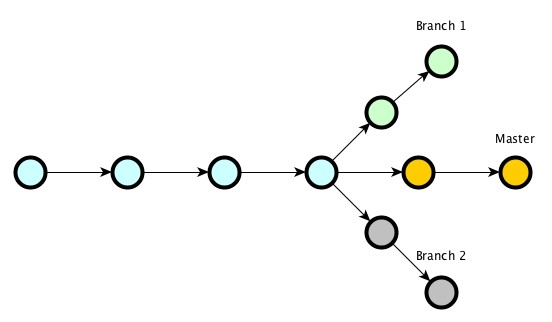

# Background

This tutorial was first presented as a workshop at [GODays 2020 Berlin](https://www.godays.io/) by [Billy Rennekamp](https://twitter.com/billyrennekamp). To view slides from this workshop please see [here](https://docs.google.com/presentation/d/1UG_Zi2FxMSWTmRBFhc4exXlJssAPasTq28cpTCHX2Ks/edit?usp=sharing). If you are interested in getting started with the scavenger hunt consider jumping ahead to [The Game](./02-the-game.md) or start building with [Starport](./03-starport-scaffolding.md)! {synopsis}

The goal of this session is to get you thinking about what is possible when developing applications that have access to **digital scarcity as a primitive**. The easiest way to think of scarcity is as money; If money grew on trees it would stop being _scarce_ and stop having value. We have a long history of software which deals with money, but it's never been a first class citizen in the programming environment. Instead, money has always been represented as a number or a float, and it has been up to a third party merchant service or some other process of exchange where the _representation_ of money is swapped for actual cash. If money were a primitive in a software environment, it would allow for **real economies to exist within games and applications**, taking one step further in erasing the line between games, life and play.

We will be working today with a Golang framework called the [Cosmos SDK](https://github.com/cosmos/cosmos-sdk). This framework makes it easy to build **deterministic state machines**. A state machine is simply an application that has a state and explicit functions for updating that state. You can think of a light bulb and a light switch as a kind of state machine: the state of the "application" is either `light on` or `light off`. There is one function in this state machine: `flip switch`. Every time you trigger `flip switch` the state of the application goes from `light on` to `light off` or vice versa. Simple, right?

A **deterministic** state machine is just a state machine in which an accumulation of actions, taken together and replayed, will have the same outcome. So if we were to take all the `switch on` and `switch off` actions of the entire month of January for some room and replay then in August, we should have the same final state of `light on` or `light off`. There's should be nothing about January or August that changes the outcome (of course a _real_ room might not be deterministic if there were things like power shortages or maintenance that took place during those periods).

What is nice about deterministic state machines is that you can track changes with **cryptographic hashes** of the state, just like version control systems like `git`. If there is agreement about the hash of a certain state, it is unnecessary to replay every action from genesis to ensure that two repos are in sync with each other. These properties are useful when dealing with software that is run by many different people in many different situations, just like git.

Another nice property of cryptographically hashing state is that it creates a system of **reliable dependencies**. I can build software that uses your library and reference a specific state in your software. That way if you change your code in a way that breaks my code, I don't have to use your new version but can continue to use the version that I reference. This same property of knowing exactly what the state of a system (as well as all the ways that state can update) makes it possible to have the necessary assurances that allow for digital scarcity within an application. _If I say there is only one of some thing within a state machine and you know that there is no way for that state machine to create more than one, you can rely on there always being only one._

You might have guessed by now that what I'm really talking about are **Blockchains**. These are deterministic state machines which have very specific rules about how state is updated. They checkpoint state with cryptographic hashes and use asymmetric cryptography to handle **access control**. There are different ways that different Blockchains decide who can make a checkpoint of state. These entities can be called **Validators**. Some of them are chosen by an electricity intensive game called **proof-of-work** in tandem with something called the longest chain rule or **Nakamoto Consensus** on Blockchains like Bitcoin or Ethereum.

The state machine we are building will use an implementation of **proof-of-stake** called **Tendermint**, which is energy efficient and can consist of one or many validators, either trusted or byzantine. When building a system that handles _real_ scarcity, the integrity of that system becomes very important. One way to ensure that integrity is by sharing the responsibility of maintaining it with a large group of independently motivated participants as validators.

So, now that we know a little more about **why** we might build an app like this, let's dive into the game itself.