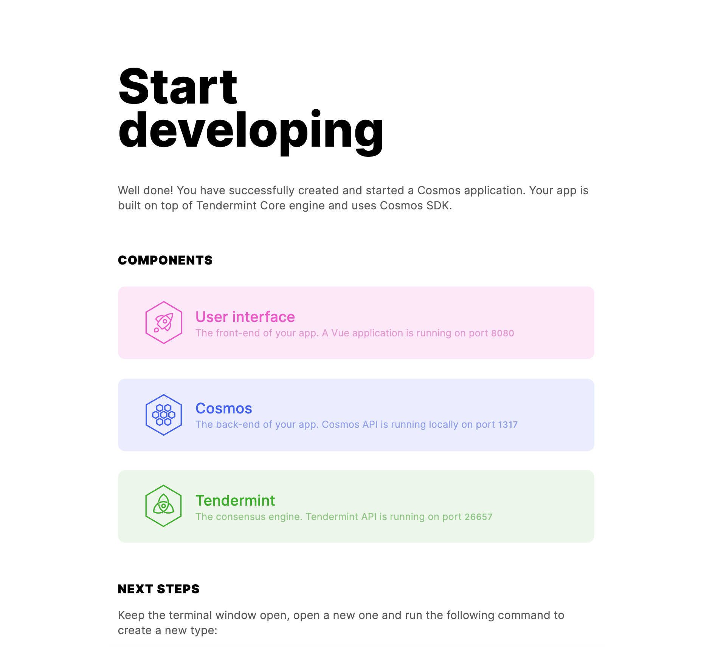
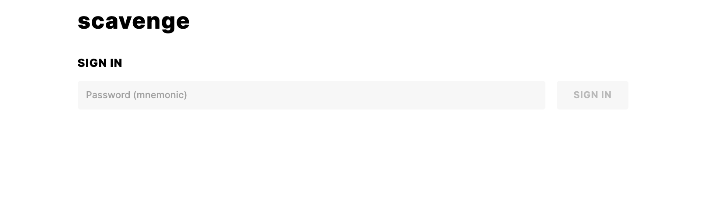

# Starting our application

Let's follow the commands to run our application.

```bash
$ cd scavenge
$ starport serve

📦 Installing dependencies...
🛠️  Building the app...
🙂 Created an account. Password (mnemonic): wheat wonder cherry please actor armed angry suggest square fringe confirm unusual equip access symbol visit cry hen one fat absorb stamp miracle alone
🙂 Created an account. Password (mnemonic): idea snack life aware merit rough end shadow pond tide sweet column visual report multiply bronze claw cry bamboo payment taxi glare process immune
🌍 Running a Cosmos 'scavenge' app with Tendermint at http://localhost:26657.
🌍 Running a server at http://localhost:1317 (LCD)

🚀 Get started: http://localhost:12345/

```

## Breaking down the `starport serve` command

From the output above, we can see the following has occurred:
- Two accounts were created with the respective [mnemonics](https://support.mycrypto.com/general-knowledge/cryptography/how-do-mnemonic-phrases-work). Later on in this tutuorial, you'll use these to log in and interact with your application.
- Our Tendermint consensus engine (think of it as a database) is running at `http://localhost:26657`
- A web server is running at `http://localhost:1317`
- A landing page is running at `http://localhost:12345`

Before starting up our application, the `serve` command runs a build for our Cosmos SDK application as well as our Vue frontend.

The build process executed by `starport serve` is similar to running `make install` in the following `Makefile`.

```
PACKAGES=$(shell go list ./... | grep -v '/simulation')

VERSION := $(shell echo $(shell git describe --tags) | sed 's/^v//')
COMMIT := $(shell git log -1 --format='%H')

ldflags = -X github.com/cosmos/cosmos-sdk/version.Name=NewApp \
	-X github.com/cosmos/cosmos-sdk/version.ServerName=scavengeD \
	-X github.com/cosmos/cosmos-sdk/version.ClientName=scavengeCLI \
	-X github.com/cosmos/cosmos-sdk/version.Version=$(VERSION) \
	-X github.com/cosmos/cosmos-sdk/version.Commit=$(COMMIT) 

BUILD_FLAGS := -ldflags '$(ldflags)'

.PHONY: all
all: install

.PHONY: install
install: go.sum
		go install -mod=readonly $(BUILD_FLAGS) ./cmd/scavengeD
		go install -mod=readonly $(BUILD_FLAGS) ./cmd/scavengeCLI
		npm --prefix ./vue i --save 
		npm --prefix ./vue run build

go.sum: go.mod
		@echo "--> Ensure dependencies have not been modified"
		GO111MODULE=on go mod verify

# Uncomment when you have some tests
# test:
# 	@go test -mod=readonly $(PACKAGES)
.PHONY: lint
# look into .golangci.yml for enabling / disabling linters
lint:
	@echo "--> Running linter"
	@golangci-lint run
	@go mod verify
```

After the application builds, the `serve` command initializes the application based on the information provided in the `config.yml` file.

<<< @/scavenge/scavenge/config.yml

You can see we've defined two `accounts` to the genesis, `user1` and `user2`, and have set up `user1` as the validator for the node we're going to run.

This setup can also be performed manually using the `scavanged` and `scavengecli` commands, which are available after the application is built.

<<< @/scavenge/scavenge/init.sh

If you want to run the application manually, you can run `scavenged start` to start your Cosmos SDK application.

```
$ scavenged start
I[2020-09-27|04:58:19.684] starting ABCI with Tendermint                module=main 
I[2020-09-27|04:58:24.900] Executed block                               module=state height=1 validTxs=0 invalidTxs=0
I[2020-09-27|04:58:24.909] Committed state                              module=state height=1 txs=0 appHash=26BB4D82E1E3BCB98EC9EAFE7139D1551B96F5AD98D3A3AE904F42AF39D16DA6
I[2020-09-27|04:58:29.940] Executed block                               module=state height=2 validTxs=0 invalidTxs=0
I[2020-09-27|04:58:29.947] Committed state                              module=state height=2 txs=0 appHash=26BB4D82E1E3BCB98EC9EAFE7139D1551B96F5AD98D3A3AE904F42AF39D16DA6
```

In a separate terminal, you can also `cd` into the `vue` directory and run `npm i && npm run serve` to start your frontend app.

```
  App running at:
  - Local:   http://localhost:8080/ 
  - Network: http://10.0.0.92:8080/

  Note that the development build is not optimized.
  To create a production build, run npm run build.
```

## Application


Let's run `starport serve` again, as it does additional hot reloading for our app out of the box. After this, we can navigate to [`localhost:12345`](http://localhost:12345), where we should see the following landing page:



This landing page re-iterates the fact that we have a web server, consensus engine, and frontend vue application running.

Let's visit our vue app at `localhost:8080`:



You can use this page to sign in using the mnemonics provided in your terminal, as well perform CRUD operations on your application.

Currently, it it only contains the boilerplate application which lets you sign in, but will contain additional contents after you scaffold some types.

Since we didn't add any types, we will start defining them in the next section.
