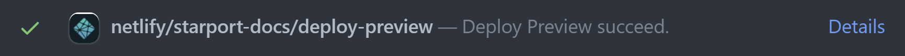

# Contributing

- [Contributing](#contributing)
  - [Using this repo](#using-this-repo)
  - [Reviewing technical content PRs](#reviewing-technical-content-prs)
  - [Writing and contributing](#writing-and-contributing)
  - [Where can I find the tutorials and docs?](#where-can-i-find-the-tutorials-and-docs)
  - [Who works on the tutorials?](#who-works-on-the-tutorials)
  - [Viewing Tutorial Builds](#viewing-tutorial-builds)
    - [Preview PRs on a Deployed Preview](#preview-prs-on-a-deployed-preview)
    - [Preview Draft PRs on a Local Web Browser](#preview-draft-prs-on-a-local-web-browser)
  

Thank you for considering making contributions. We appreciate your interest in helping us to create and maintain awesome tutorials.

To set up your environment for success, follow our [technical set up](technical-setup.md) guidelines.

## Using this repo

- To provide feedback, file an issue and provide abundant details to help us understand how we can make it better.
- To provide feedback and a fix, you can make a direct contribution. This repo is protected since we provide the code and the docs to help you learn. If you're not a member or maintainer, fork the repo and then submit a pull request (PR) from your forked repo to the `develop` branch.
- Start by creating a draft pull request. Create your draft PR early, even if your work is just beginning or incomplete. Your draft PR indicates to the community that you're working on something and provides a space for conversations early in the development process. Merging is blocked for `Draft` PRs, so they provide a safe place to experiment and invite comments. 

## Reviewing technical content PRs 

Some of the best content contributions come during the PR review cycles. Follow best practices for technical content PR reviews just like you do for code reviews. For in-line suggestions, use the [GitHub suggesting feature](https://docs.github.com/en/github/collaborating-with-pull-requests/reviewing-changes-in-pull-requests/commenting-on-a-pull-request). The PR owner can merge in your suggested commits one at a time or in batch (preferred). When you do a more granular extensive review that results in more than 20 in-line suggestions, go ahead and check out the branch and make the changes yourself. 

## Writing and contributing

We welcome contributions to the tutorials. 

Our technical content follows the [Google developer documentation style guide](https://developers.google.com/style). Highlights to help you get started:

- [Highlights](https://developers.google.com/style/highlights)
- [Word list](https://developers.google.com/style/word-list)
- [Style and tone](https://developers.google.com/style/tone)
- [Writing for a global audience](https://developers.google.com/style/translation)
- [Cross-references](https://developers.google.com/style/cross-references)
- [Present tense](https://developers.google.com/style/tense)

The Google guidelines include more material than is listed here and are used as a guide that enables easy decision making about proposed content changes. 

Other useful resources:

- [Google Technical Writing Courses](https://developers.google.com/tech-writing)
- [GitHub Guides Mastering Markdown](https://guides.github.com/features/mastering-markdown/)

## Where can I find the tutorials and docs?

Technical content includes Knowledge Base article and interactive tutorials. 
 
- The Knowledge Base content is in the `docs/kb` folder. 
- The Starport Developer Guide content is in the `docs/guide` folder. 

Locations and folders for other content can vary. Explore the self-describing folders for the content that you are interested in. Some articles and tutorials reside in a single Markdown file while sub-folders might be present for other tutorials.

As always, work-in-progress content might be happening in other locations and repos.

## Who works on the tutorials?

The Tendermint (All in Bits) Developer Experience team is focused on building Starport and developing tutorials.

The Tendermint (All in Bits) Ecosystem Development team owns the technical content and tutorials and manages developer onboarding.

Meet the [people behind Starport and contributors](https://github.com/tendermint/starport/graphs/contributors).

## Viewing Tutorial Builds

There are two ways to see what your changes will look like in production before the updated pages are published.

- When a PR is ready for review, you can see a deployed preview on a URL that is unique for that PR.
- While a PR is in draft mode, you can preview a local build.

### Preview PRs on a Deployed Preview

After the PR moves from **Draft** to **Ready for review**, the CI status checks generate a Netlify deploy preview. Netlify keeps this preview up to date as you continue to work and commit new changes to the same branch.

To view a deployed preview on a **Ready for review** PR, click the **Details** link on the netlify commit status line:



### Preview Draft PRs on a Local Web Browser

Since the deploy preview doesn't work on Draft PRs, follow these steps to preview the tutorial build on a local web browser.

1. If you haven't already, clone the tutorials repo to your local machine and change to that directory. For example:

    ```bash
    cd ~/github
    git clone https://github.com/tendermint/starport
    cd starport
    cd docs
    ```

2. Local tutorials require JavaScript. If needed, install [npm](https://docs.npmjs.com/cli/v6/commands/npm-install).

3. For each branch you work in, install the npm packages for the SDK tutorials:

    ```bash
    npm install
    ```

4. Start the local instance of the tutorial build:

    ```bash
    npm run serve
    ```

    A successful client compile looks like: 
    
    ```bash
    > VuePress dev server listening at http://localhost:8080/ ✔ Client Compiled successfully in 280.71ms success [12:06:28] Build 03d41f finished in 283 ms! ( http://localhost:8080/ )
    ```

5. You can now view the docs build on a local web browser. Isn't this fun?

    Tip: On a mac, press the command key and click `http://localhost:8080/` for quick access to the local preview. If you are already using port 8080 on your local machine, the preview increments to the next available port 8081, and so on. 
