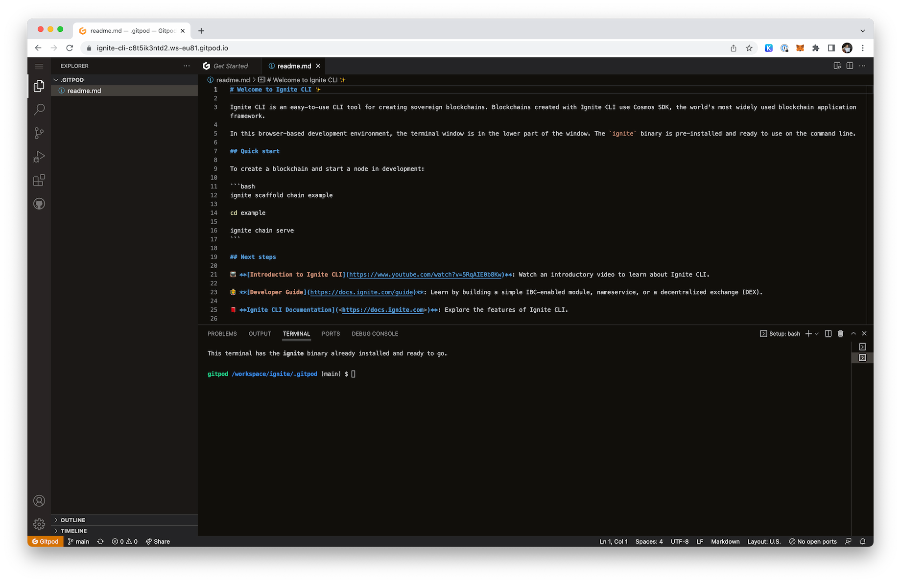
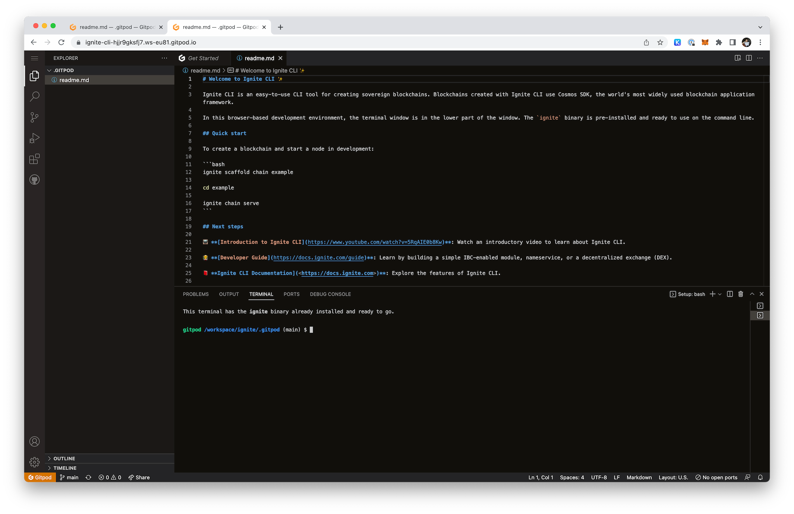

# Launch your testnet with Gitpod

In this tutorial you will create a new Cosmos SDK chain with Ignite and launch a testnet online using nothing but your browser.

To accomplish this you will be using a service called [Gitpod](https://gitpod.io), which allows you to launch a cloud-based development environment in your browser. This environment is preconfigured with everything you need, including Ignite CLI. Think of it as a virtual server with a Visual Studio Code interface attached.

You will launch two Gitpod instances either in tabs or windows of your browser. Both instance will represent a validator node of your testnet. The first instance will also act as a coordinator.

## Starting a first Gitpod instance

* Follow the link: https://gitpod.io/#https://github.com/ignite/cli
* Click "Continue with GitHub"
* Authorize Gitpod to access your GitHub account
* Wait while Gitpod prepares the environment... It might take a while, but it's worth it.

When the process is complete, you will see a Visual Studio Code interface in your browser. It will look something like this:



At the bottom of the screen you will see a terminal window. This is where you will run all the commands.

## Starting a second Gitpod instance

* Open a new tab in your browser
* Follow the link: https://gitpod.io/#https://github.com/ignite/cli
* Click "New Workspace"
* Wait while Gitpod prepares the environment...

When the process is complete, you will see something like this:



In each tab you have a Gitpod instances. We will refer to the first one as "Instance 1" and the second one as "Instance 2". Each instance has a unique URL, which you can see in the address bar of your browser.

## Prepare a chain to launch

If you already have a Cosmos SDK chain, you can use that. Otherwise, you can create a new one with Ignite CLI on your **local machine**. If you don't have Ignite CLI installed, follow the [installation instructions](../installation.md). Run the following command to create a new chain:

```
ignite scaffold chain example
```

This will create a new chain in the `example` directory. You can add some functionality to your chain by following tutorials or keep it simple as is.

Push the source code of the `example` chain to a new GitHub repository.

Alternatively, you can just use https://github.com/ignite/example, which is a simple chain created with Ignite CLI.

## Publish your chain

Now that you have a chain to launch, you need to publish it on Ignite. This will allow other people to join your testnet.

Run the following command on **Instance 1**:

```
ignite network chain publish github.com/ignite/example
```

You will see the following output:

```
Source code fetched
Blockchain set up
Chain's binary built
Blockchain initialized
Genesis initialized
✔ Network published 
⋆ Launch ID: 6
```

The `Launch ID` identifies your chain on Ignite. You will be using `6` as your `Launch ID` in the following commands.

## Join as a validator on Instance 1

Now that your chain has been published you can join it as a validator. Run the following command on **Instance 1** (that is correct, the same instance as above) to initialize a validator node:

```
ignite network chain init 6
```

Ignite will prompt your for values. You can use the default values for all of them. 

```
Source code fetched
Blockchain set up
Blockchain initialized
Genesis initialized
? Staking amount 95000000stake
? Commission rate 0.10
? Commission max rate 0.20
? Commission max change rate 0.01
⋆ Gentx generated: /home/gitpod/spn/6/config/gentx/gentx.json
```

"Staking amount" refers to the amount of self-delegation.

Send a request to join your chain as a validator on **Instance 1**:

```
ignite network chain join 6 --amount 95000000stake
```

The `join` command above sends two requests to Ignite: to join as a validator and to add an account. The `--amount` flag is the amount of tokens you request. It must be equal or higher to the amount you provided in the previous command.

```
Source code fetched
Blockchain set up
⋆ Account added to the network by the coordinator!
Validator added to the network by the coordinator!
```

Notice that both the account and validator got automatically added to the network. This is because you are the coordinator of your testnet, so you don't have to approve your own request to join as a validator.

You can list all the requests to join your chain with the following command:

```
ignite network request list 6
```

```
Id      Status          Type                    Content 
1       APPROVED        Add Genesis Account     spn12ewv6yxzdhevka4rz339w4p6dj4eh7f0hj76ry, 95000000stake 
2       APPROVED        Add Genesis Validator   116b4ec1bbdcf19def8b82335317123852a112c6@https://7575-ignite-cli-c8t5ik3ntd2.ws-eu81.gitpod.io, spn12ewv6yxzdhevka4rz339w4p6dj4eh7f0hj76ry, 95000000stake 
```

## Join as a validator on Instance 2

You can now join as a second validator. Run the following command on **Instance 2** to initialize a validator node:

```
ignite network chain init 6
```

It might take longer for the command to finish, because you're running it on a different machine and Ignite needs to download the chain's source code again and compile it before you can proceed.

The process is the same as above. You will be prompted for values. You can use the default values for all of them.

```
Source code fetched
Blockchain set up
Chain's binary built
Blockchain initialized
Genesis initialized
? Staking amount 95000000stake
? Commission rate 0.10
? Commission max rate 0.20
? Commission max change rate 0.01
⋆ Gentx generated: /home/gitpod/spn/6/config/gentx/gentx.json
```

Send a request to join your chain as a validator on **Instance 2**:

```
ignite network chain join 6 --amount 95000000stake
```

```
Source code fetched
Blockchain set up
⋆ Request 3 to add account to the network has been submitted!
Request 4 to join the network as a validator has been submitted!
```

## Approve the requests and trigger the launch on Instance 1

Switch back to **Instance 1** and approve requests received from validator 2:

```
ignite network request approve 6 3,4
```

```
Source code fetched
Blockchain set up
Requests format verified
Blockchain initialized
Genesis initialized
Genesis built
The network can be started
✔ Request(s) #3, #4 verified
✔ Request(s) #3, #4 approved
```

You now have two validators approved for your testnet.

You can now trigger the launch of your testnet on **Instance 1**:

```
ignite network chain launch 6
```

```
Chain 6 will be launched on 2023-01-06 10:09:06.712021355 +0000 UTC m=+35.133616724
```

The `launch` command freezes the changes to the chain launch information and communicates to validator the the chain is ready to be launched.

## Launch a validator node on Instance 1

On the same instance, as a validator you can run the following command to download the finalized genesis and prepare the node to start on **Instance 1**:

```
ignite network chain prepare 6
```

```
Source code fetched
Blockchain set up
Genesis initialized
Genesis built
✔ Chain is prepared for launch

You can start your node by running the following command:
        /workspace/go/bin/ignite network tool proxy-tunnel /home/gitpod/spn/6/spn.yml & exampled start --home /home/gitpod/spn/6
```

Now that you have the finalized genesis, you can start your node:

```
/workspace/go/bin/ignite network tool proxy-tunnel /home/gitpod/spn/6/spn.yml & exampled start --home /home/gitpod/spn/6
```

You will see output from the node in your terminal. So far you've just started a single validator node. Your chain cannot launch with only 50% of the voting power. You need to start a second validator node.

## Launch a validator node on Instance 2

Run the following command to download the finalized genesis and prepare the node to start on **Instance 2**:

```
ignite network chain prepare 6
```

```
Source code fetched
Blockchain set up
Genesis initialized
Genesis built
✔ Chain is prepared for launch

You can start your node by running the following command:
        /workspace/go/bin/ignite network tool proxy-tunnel /home/gitpod/spn/6/spn.yml & exampled start --home /home/gitpod/spn/6
```

Start your node:

```
/workspace/go/bin/ignite network tool proxy-tunnel /home/gitpod/spn/6/spn.yml & exampled start --home /home/gitpod/spn/6
```