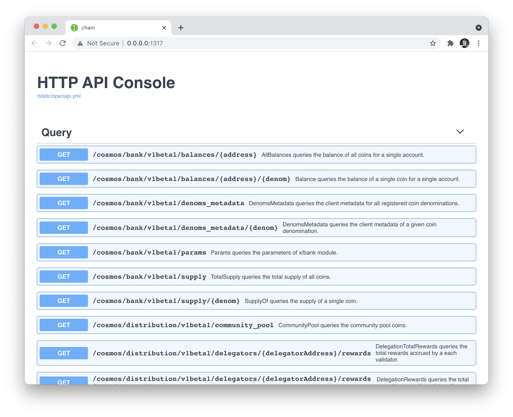

# Hello, World

This tutorial is a great place to start your journey into the Cosmos ecosystem. Instead of wondering how to build a blockchain, follow these steps to build your first blockchain and your first Cosmos SDK module. 

## Get Started

The first step is to install [Starport](https://docs.starport.network/), the tool that offers everything you need to build, test, and launch your blockchain with a decentralized worldwide community. 

This tutorial is based on a specific version of Starport, so to install Starport v0.17.1 use the following command:

```bash
curl https://get.starport.network/starport@v0.17.1! | bash
```

Starport comes with a number of scaffolding commands that are designed to make development easier by creating everything that's required to start working on a particular task. 

One of these tasks is a foundation of a fresh Cosmos SDK blockchain so that you don't have to write it yourself. To build your blockchain foundation, use the `starport scaffold chain` command.

Are you ready? Open a terminal and navigate to a directory where you have permissions to create files. To create your Cosmos SDK blockchain with the default directory structure, run this command:

```bash
starport scaffold chain github.com/cosmonaut/hello
```

This command creates a Cosmos SDK blockchain called Hello in a `hello` directory. The source code inside the `hello` directory contains a fully functional ready-to-use blockchain. 

This new blockchain imports standard Cosmos SDK modules, including: 

- [`staking`](https://docs.cosmos.network/v0.42/modules/staking/) (for delegated proof of stake)
- [`bank`](https://docs.cosmos.network/v0.42/modules/bank/) (for fungible token transfers between accounts)
- [`gov`](https://docs.cosmos.network/v0.42/modules/gov/) (for on-chain governance)
- And [other modules](https://docs.cosmos.network/v0.42/modules/)

Now that you have run your first command, take a minute to see all of the command line options for the `scaffold` command. You can use --help on any command. Run the `starport scaffold chain --help` command to learn about the command you just used.

## Blockchain Directory Structure

After you create the blockchain, switch to its directory:

```bash
cd hello
```

The `hello` directory contains a number of generated files and directories that make up the structure of a Cosmos SDK blockchain. Most of the work in this tutorial happens in the `x` directory. Here is a quick overview of files and directories that are created by default:

| File/directory | Purpose                                                                                                                                                                        |
| -------------- | ------------------------------------------------------------------------------------------------------------------------------------------------------------------------------ |
| app/           | Files that wire together the blockchain. The most important file is `app.go` that contains type definition of the blockchain and functions to create and initialize it. |
| cmd/           | The main package responsible for the CLI of compiled binary.                                                                                                          |
| docs/          | Directory for project's documentation. By default, an OpenAPI spec is generated.                                                                                                |
| proto/         | Protocol buffer files describing the data structure>                                                                                                                                             |
| testutil/      | Helper functions for testing.                                                                                                                                          |
| vue/           | A Vue 3 web app template.                                                                                                                                             |
| x/             | Cosmos SDK modules and custom modules.                                                                                                                                                        |
| config.yml     | A configuration file for customizing a chain in development.                                                                                                                    |

Now you can get your blockchain up and running locally on a single node.

## Start a Blockchain

You already have a fully-functional blockchain. To start your chain on your development machine, run the following command in the `hello` directory

```bash
starport chain serve
```

This command downloads dependencies and compiles the source code into a binary called `hellod`. By default, Starport uses the name of the repo + `d`. From now on, use this binary to run all of your chain commands. For example, to initialize a single validator node and start a node.

## HTTP API Console

By default a validator node exposes two API endpoints: 

- [http://localhost:26657](http://localhost:26657) for the low-level Tendermint API
- [http://localhost:1317](http://localhost:1317) for the high-level blockchain API

Now that you started your `hello` chain, you can use a web browser to see the high-level `hello` blockchain API:



## Stop a Blockchain

When you want to stop your blockchain, press Ctrl+C in the terminal window where it's running. 

In the development environment, you don't have to restart the blockchain after you make changes. All changes you make in the `hello` directory files are automatically picked up by Starport.

## Say "Hello, Starport"

To get your Cosmos SDK blockchain to say "Hello", you need to make these changes:

- Modify a protocol buffer file
- Create a keeper query function that returns data
- Register a query function

Protocol buffer files contain proto rpc calls that define Cosmos SDK queries and message handlers, and proto messages that define Cosmos SDK types. rpc calls are also responsible for exposing an HTTP API. 

For each Cosmos SDK module, the [Keeper](https://docs.cosmos.network/v0.42/building-modules/keeper.html) is an abstraction for modifying the state of the blockchain. Keeper functions let you query or write to the state. After you add the first query to your chain, you must register the query. You only need to register a query once.

In terms of workflow, developers typically follow this sequence:

- Start with proto files to define Cosmos SDK [messages](https://docs.cosmos.network/v0.42/building-modules/msg-services.html)
- Define and register [queries](https://docs.cosmos.network/v0.42/building-modules/query-services.html) 
- Define message handlers logic
- Finally, implement the logic of these queries and message handlers in keeper functions.

## Create a Query

Create a `posts` query:

```bash
starport scaffold query posts --response title,body
```

`query` accepts a name of the query (in this case, `posts`), an optional list of request parameters (in this case, empty), and an optional comma-separated list of response fields with a `--response` flag (in this case, `body,title`).

The `query` command has created and modified several files:

- modified `proto/hello/query.proto`
- created `x/hello/keeper/grpc_query_posts.go`
- modified `x/hello/client/cli/query.go`
- created `x/hello/client/cli/query_posts.go`

Let's examine some of these changes. For clarity, the following code blocks do not show the placeholder comments that Starport uses to scaffold code. Don't delete these placeholders since they are required to continue using Starport's scaffolding functionality.

### Updates to the Query Service  

In the `proto/hello/query.proto` file, the `Posts` rpc has been added to the `Query` service.

```proto
service Query {
  rpc Posts(QueryPostsRequest) returns (QueryPostsResponse) {
    option (google.api.http).get = "/cosmonaut/hello/hello/posts";
  }
}
```

Here's how the `Posts` rpc for the `Query` service works:

- Is responsible for returning a list of all the posts on chain
- Accepts request parameters (`QueryPostsRequest`)
- Returns response of type `QueryPostsResponse`
- The `option` defines the endpoint that is used by gRPC to generate an HTTP API

### Request and Reponse Types

Now, take a look at the following request and response types:

```proto
message QueryPostsRequest {
}

message QueryPostsResponse {
  string title = 1;
  string body = 2;
}
```

- The `QueryPostsRequest` message is empty because requesting all posts doesn't require parameters. 
- The `QueryPostsResponse` message contains `title` and `body` that is returned from the chain.

## Posts Keeper Function 

The `x/hello/keeper/grpc_query_posts.go` file contains the `Posts` keeper function that handles the query and returns data.

```go
func (k Keeper) Posts(c context.Context, req *types.QueryPostsRequest) (*types.QueryPostsResponse, error) {
  if req == nil {
    return nil, status.Error(codes.InvalidArgument, "invalid request")
  }
  ctx := sdk.UnwrapSDKContext(c)
  _ = ctx
  return &types.QueryPostsResponse{}, nil
}
```

Here's all of the actions the `Posts` function does:

- Makes a basic check on the request and throws an error if it's `nil`
- Stores context in a `ctx` variable that contains information about the environment of the request
- Returns a response of type `QueryPostsResponse`

Right now the response is empty.

### Update Keeper Function

From the `query.proto` file we know that response accepts `title` and `body`, so use a text editor to modify the `x/hello/keeper/grpc_query_posts.go` file that contains the keeper function. On the last line of the keeper function, change the line to return a "Hello!":

```go
func (k Keeper) Posts(c context.Context, req *types.QueryPostsRequest) (*types.QueryPostsResponse, error) {
  //...
  return &types.QueryPostsResponse{Title: "Hello!", Body: "Starport"}, nil
}
```

Save the file to restart your chain. Visit the [posts endpoint](http://localhost:1317/cosmonaut/hello/hello/posts), you see a `Not Implemented` error. This message is expected behavior, because you still need to register the query handlers with gRPC.


## Register Query Handlers

Make the required changes to the `x/hello/module.go` file. As shown in the following example, in the import `"context"` section, search for `RegisterGRPCGatewayRoutes`, and register the query handlers:

```go
import (
  //...
  "context"
)

func (AppModuleBasic) RegisterGRPCGatewayRoutes(clientCtx client.Context, mux *runtime.ServeMux) {
  types.RegisterQueryHandlerClient(context.Background(), mux, types.NewQueryClient(clientCtx))
}
```

Now you're ready to start your blockchain:

```go
starport chain serve
```

After the chain has been started, visit [http://localhost:1317/cosmonaut/hello/hello/posts](http://localhost:1317/cosmonaut/hello/hello/posts) and see your text displayed!

```go
{
  "title": "Hello!",
  "body": "Starport"
}
```

The `query` command has also scaffolded `x/hello/client/cli/query_posts.go` that implements a CLI equivalent of the posts query and mounted this command `x/hello/client/cli/query_posts.go` . Run the following command and get the same JSON response:

```go
hellod q hello posts
```

Congratulations, you have built your first blockchain and your first Cosmos SDK module. Continue the journey to learn more about scaffolding Cosmos SDK messages, types in protocol buffer files, the keeper, and more.
