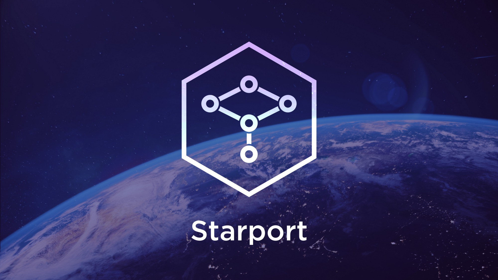

# 

## Introduction

Starport is the easiest way to build blockchains. It is a developer-friendly interface to the [Cosmos SDK](https://github.com/cosmos/cosmos-sdk), the world's most widely-used blockchain application framework. Starport generates boilerplate code for you, so you can focus on writing business logic.

* [Check out the features in Starport v0.11](https://www.youtube.com/watch?v=rmbPjCGDXek)
* [Start building your blockchain](https://gitpod.io/#https://github.com/tendermint/starport/)

## Documentation

To learn how to use Starport, check out [`/docs`](/docs/README.md).

## Questions

For questions and support please join the #starport channel in the [Cosmos Community Discord](https://discord.com/invite/W8trcGV). The issue list of this repo is exclusively for bug reports and feature requests.

## Contributing

`develop` contains the development version. Find the last stable release under https://github.com/tendermint/starport/releases.

You can branch of from `develop` and create a Pull Request or maintain your own fork and submit a Pull Request from there.

## Stay in touch

Starport is a product built by [Tendermint](https://tendermint.com). Follow us to get the latest updates!

- [Twitter](https://twitter.com/tendermint_team)
- [Blog](https://medium.com/tendermint)
- [Jobs](https://tendermint.com/careers)
