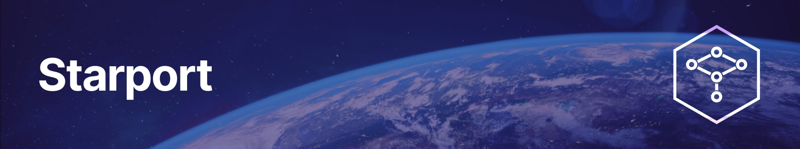

# 

Starport is the easiest way to build a blockchain. It is a developer-friendly interface to the [Cosmos SDK](https://github.com/cosmos/cosmos-sdk), the world's most widely-used blockchain application framework. Starport generates boilerplate code for you, so you can focus on writing business logic.

* [**Build a blockchain with Starport in a web-based IDE**](https://gitpod.io/#https://github.com/tendermint/starport/)
* [Check out the latest features in v0.12](https://www.youtube.com/watch?v=eQYf0Z2pJD0)

## Quick start

Open Starport [in your browser](https://gitpod.io/#https://github.com/tendermint/starport/), or [install it](/docs/1%20Introduction/2%20Install.md). Then:

```
starport app github.com/foo/mychain

cd mychain

starport serve
```

## Documentation

To learn how to use Starport, check out the [Starport Documentation](/docs/README.md). To install Starport locally on GNU/Linux or macOS, follow [these steps](/docs/1%20Introduction/2%20Install.md).

## Questions

For questions and support please join the #starport channel in the [Cosmos Community Discord](https://discord.com/invite/W8trcGV). The issue list of this repo is exclusively for bug reports and feature requests.

## Contributing

We welcome contributions from everyone. The `develop` contains the development version. You can branch of from `develop` and create a pull request, or maintain your own fork and submit a cross-repository pull request. Thank you to all those who have contributed to Starport!

## Stay in touch

Starport is a free and open source product maintained by [Tendermint](https://tendermint.com). Follow us to get the latest updates!

- [Twitter](https://twitter.com/tendermint_team)
- [Blog](https://medium.com/tendermint)
- [Jobs](https://tendermint.com/careers)
