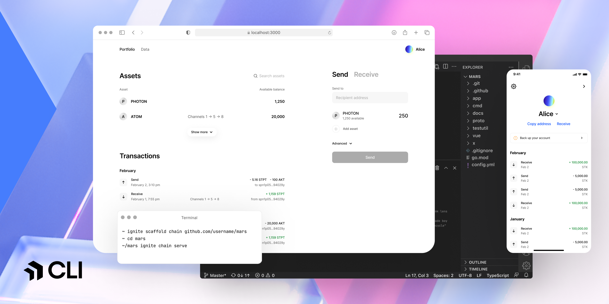

<div align="center">
  <h1> Ignite </h1>
</div>

<div align="center">
  <a href="https://github.com/ignite/cli/blob/main/LICENSE">
    
  </a>
  <a href="https://pkg.go.dev/github.com/ignite/cli?tab=doc">
    
  </a>
  <a href="https://goreportcard.com/report/github.com/ignite/cli">
    
  </a>
<!--
  <a href="https://codecov.io/gh/ignite/cli">
    
  </a>
-->
</div>
<div align="center">
  <a href="https://github.com/ignite/cli">
    
  </a>
    
    
    <a href="https://discord.com/invite/ignite" target="_blank"></a>
</div>



[Ignite CLI](https://ignite.com/cli) is the all-in-one platform to build,
launch, and maintain any crypto application on a sovereign and secured
blockchain. It is a developer-friendly interface to the [Cosmos
SDK](https://github.com/cosmos/cosmos-sdk), the world's most widely-used
blockchain application framework. Ignite CLI generates boilerplate code for you,
so you can focus on writing business logic.

## Quick start

Ignite CLI can be installed using popular package managers such as Homebrew and Snap, making it easy to stay up-to-date with the latest versions. These package manager installations are maintained regularly for both macOS and GNU/Linux. For those who prefer manual installation or need to set up a development environment, additional instructions are provided at the end of this section.

### Installation

Install Ignite using [Homebrew](https://formulae.brew.sh/formula/ignite) on macOS and GNU/Linux:

```sh
brew install ignite
```

Or using Snap on GNU/Linux:

```sh
snap install ignite --classic
```

Or manually using the following command:

```sh
curl https://get.ignite.com/cli! | bash
```

<details>
  <summary>Troubleshoot</summary>

If Ignite doesn't automatically move to your `/usr/local/bin` directory, use the following command:

```sh
sudo mv ignite /usr/local/bin
```

If you encounter an error, you may need to create the `/usr/local/bin` directory and set the necessary permissions:

```sh
mkdir /usr/local/bin
sudo chown -R $(whoami) /usr/local/bin
```

</details>

To create and start a blockchain:

```sh
ignite scaffold chain mars

cd mars

ignite chain serve
```

The instructions for installing Ignite CLI manually and configuring your system are provided below.

<details>
  <summary>View development setup instructions</summary>

#### Supported Operating Systems

- GNU/Linux
- macOS

#### Install Go

1. Install the latest version of Go.
2. Download the release suitable for your system.
3. Follow the installation instructions.

**Note:** We recommend not using `brew` to install Go.

#### Add the Go bin Directory to Your PATH

1. Edit your `~/.bashrc` file and add the following line:

   ```sh
   export PATH=$PATH:$(go env GOPATH)/bin
   ```

2. Apply the changes:

   ```sh
   source ~/.bashrc
   ```

#### Remove Existing Ignite CLI Installations

1. Remove the Ignite CLI binary:

   ```sh
   rm $(which ignite)
   ```

   You may need to run this with `sudo`.

2. Repeat the step until all Ignite CLI installations are removed.

#### Install Ignite CLI

```sh
curl https://get.ignite.com/cli! | bash
```

#### Clone the Ignite CLI Repo

1. Clone the repository:

   ```sh
   git clone --depth=1 git@github.com:ignite/cli.git
   ```

2. Change to the `cli` directory:

   ```sh
   cd cli
   ```

#### Run make install

```sh
make install
```

#### Verify Your Ignite CLI Version

```sh
ignite version
```

</details>

Alternatively, you can open Ignite CLI directly in your web browser via [GitHub Codespaces](https://github.com/features/codespaces): [Open in GitHub Codespaces](https://github.dev/ignite/cli).

## Documentation

To learn how to use Ignite CLI, check out the [Ignite CLI
docs](https://docs.ignite.com). To learn more about how to build blockchain apps
with Ignite CLI, see the [Ignite CLI Developer
Tutorials](https://tutorials.ignite.com).

To install Ignite CLI locally on GNU, Linux, or macOS, see [Install Ignite
CLI](https://docs.ignite.com/welcome/install).

To learn more about building a JavaScript frontend for your Cosmos SDK
blockchain, see [ignite/web](https://github.com/ignite/web).

## Questions

For questions and support, join the official [Ignite
Discord](https://discord.gg/ignite) server. The issue list in this repo is
exclusively for bug reports and feature requests.

## Cosmos SDK compatibility

Blockchains created with Ignite CLI use the [Cosmos
SDK](https://github.com/cosmos/cosmos-sdk) framework. To ensure the best
possible experience, use the version of Ignite CLI that corresponds to the
version of Cosmos SDK that your blockchain is built with. Unless noted
otherwise, a row refers to a minor version and all associated patch versions.

| Ignite CLI  | Cosmos SDK  | IBC                  | Notes                                                         |
| ----------- | ----------- | -------------------- | ------------------------------------------------------------- |
| v28.x.y     | v0.50.x     | v8.0.0               | -                                                             |
| v0.27.1     | v0.47.3     | v7.1.0               | -                                                             |
| v0.26.0     | v0.46.7     | v6.1.0               | -                                                             |
| v0.25.2     | v0.46.6     | v5.1.0               | Bump Tendermint version to v0.34.24                           |
| v0.25.1     | v0.46.3     | v5.0.0               | Includes Dragonberry security fix                             |
| ~~v0.24.0~~ | ~~v0.46.0~~ | ~~v5.0.0~~           | This version is deprecated due to a security fix in `v0.25.0` |
| v0.23.0     | v0.45.5     | v3.0.1               |                                                               |
| v0.21.1     | v0.45.4     | v2.0.3               | Supports Cosmos SDK v0.46.0-alpha1 and above                  |
| v0.21.0     | v0.45.4     | v2.0.3               |                                                               |
| v0.20.0     | v0.45.3     | v2.0.3               |                                                               |
| v0.19       | v0.44       | v1.2.2               |                                                               |
| v0.18       | v0.44       | v1.2.2               | `ignite chain serve` works with v0.44.x chains                |
| v0.17       | v0.42       | Same with Cosmos SDK |                                                               |

To upgrade your blockchain to the newer version of Cosmos SDK, see the
[Migration guide](https://docs.ignite.com/migration).

## Ignite Apps

Ignite Apps aims to extend the functionality of Ignite CLI, offering both official and community-contributed integrations. These integrations are designed to streamline development processes and offer valuable insights for blockchain app developers.

### How to Install an Ignite App

```bash
ignite app install -g github.com/ignite/apps/[app-name]
```

The `ignite app list` command allows to list the plugins and their status, and to
update a plugin if you need to get the latest version.

### How to Create an App

Scaffold your Ignite app with one simple command:

```bash
ignite scaffold app path/to/your/app
```

Afterwards, install using:

```bash
ignite app install -g path/to/your/app
```

For more information, refer to [Creating Ignite Apps](https://docs.ignite.com/apps/developing-apps).

Also check out the section of our [example Apps](https://github.com/ignite/apps/tree/main/examples).

## Contributing to Ignite CLI

We welcome contributions from everyone. The `main` branch contains the
development version of the code. You can create a branch from `main` and
create a pull request, or maintain your own fork and submit a cross-repository
pull request.

Our Ignite CLI bounty program provides incentives for your participation and
pays rewards. Track new, in-progress, and completed bounties in the [GitHub Issues
board](https://github.com/ignite/cli/issues?q=is%3Aissue+is%3Aopen+label%3Abounty).

**Important** Before you start implementing a new Ignite CLI feature, the first
step is to create an issue on GitHub that describes the proposed changes.

If you're not sure where to start, check out [contributing.md](contributing.md)
for our guidelines and policies for how we develop Ignite CLI. Thank you to
everyone who has contributed to Ignite CLI!

## Community

Ignite CLI is a free and open source product maintained by
[Ignite](https://ignite.com). Here's where you can find us. Stay in touch.

- [ignite.com website](https://ignite.com)
- [@ignite on Twitter](https://twitter.com/ignite)
- [ignite.com/blog](https://ignite.com/blog)
- [Ignite Discord](https://discord.com/invite/ignite)
- [Ignite YouTube](https://www.youtube.com/@ignitehq)
- [Ignite docs](https://docs.ignite.com)
- [Ignite jobs](https://ignite.com/careers)
